# Brukerguide for LiveRes

## Innhold

- [Introduksjon](#introduksjon)
- [Korte guider](#korte-guider)
  - [eTiming og Brikkesys](#etiming-og-brikkesys)
  - [Time4o](#time4o)
- [Installasjon av klient](#installasjon-av-klient)
- [Gjøre klart løpet på LiveRes admin siden](#gjøre-klart-løpet-på-liveres-admin-siden)
- [Admin-siden](#admin-siden)
- [Opplasting av resultater til nett](#opplasting-av-resultater-til-nett)
  - [Tilkobling til eTiming](#tilkobling-til-etiming)
  - [Tilkobling til Brikkesys](#tilkobling-til-brikkesys)
  - [Tilkobling til Time4o (for strekktider)](#tilkobling-til-time4o-for-strekktider)
- [Oppsett av tidtakings-database](#oppsett-av-tidtakings-database)
- [Online påmelding og brikkebytte](#online-påmelding-og-brikkebytte)
- [Brikkesjekk](#brikkesjekk)
- [Diverse spesielle visninger](#diverse-spesielle-visninger)
- [Oppsett av lokal web-server](#oppsett-av-lokal-web-server)
- [API for meldinger](#api-for-meldinger)
- [Kontakt](#kontakt)

# Introduksjon

LiveRes består av en web-komponent og en PC-klient. PC-klienten er et Windows-program som leser resultater fra eTiming- eller Brikkesys-databasen og sender dem til en web-server. For løp med Time4o hentes resultatene direkte fra Time4o sin database i skyen. Dette muliggjør online resultatvisning fra løp der tidtaking gjøres med eTiming, Brikkesys og Time4o.

LiveRes er basert på og videreutviklet fra åpen kildekode publisert av [Peter Löfås](https://github.com/petlof/liveresults/). Sammenlignet med den originale kildekoden er det lagt til funksjonalitet for å lese eTiming-, Brikkesys- og Time4o-baser. Mange funksjoner for webpresentasjon er også oppdatert. Det originale prosjektet viser resultater på [liveresultat.orientering.se](http://liveresultat.orientering.se).

LiveRes-kildekoden finnes åpent på [GitHub](https://github.com/palkitt/liveresults).

# Korte guider

## eTiming og Brikkesys 

1. Kontakt Pål Kittilsen ([pal.kittilsen@gmail.com](mailto:pal.kittilsen@gmail.com)) for å få tilsendt brukernavn og passord til admin-siden, samt lenke til nedlasting av konfigurasjonsfil for LiveRes PC-klient.
2. Opprett arrangementet på siden [https://liveres.live/adm/](https://liveres.live/adm/). Merk at "organizer" og "date" må være det samme som i eTiming. Noter deg "CompetitionID" som blir opprettet.
3. Last ned og pakk ut klientprogrammet herfra: [GitHub](https://github.com/palkitt/liveresults/releases). Erstatt config-filen med den du lastet ned via lenken i punkt 1.
4. Start programmet `Liveresults.Client.exe`
5. Velg eTiming, Brikkesys eller IOF XML (Time4o), og koble til en aktuell løpsdatabase. Skriv inn "CompetitionID" som ble notert under punkt 1.
6. Start synkronisering, og resultatene publiseres på [https://liveres.live](https://liveres.live)

## Time4o

For Time4o-løp hentes resultatene direkte fra Time4o sine servere. Det gir liten tidsforsinkelse og krever kun et enkelt oppsett. Man kan i tillegg velge å registrere løpet i LiveRes sin base (se informasjon om bruker og passord over). Da får man tilgang til mange LiveRes-spesifikke funksjoner, blant annet online strekktider.

1. For å få Time4o-løp synlig i LiveRes må valget "Vis løp i LiveRes" være aktivt i Time4o. Se hjelpesidene til Time4o.
2. Resultater i Time4o kommer automatisk opp i LiveRes så lenge det er aktive synk-oppgaver på "løp- og klassedata" og "påmeldingsdata" mot Time4o Center.

Disse to stegene er tilstrekkelige for visning av Time4o-løp i LiveRes-format. Videre forklares det hvordan man registrerer løpet i LiveRes sin løpsbase og får tilgang til flere funksjoner som strekktider, speakervisning, meldinger, startregistrering, løpere i skogen, Livelox-kobling og justerbare visningsparametere. Gjør dette for å koble Time4o-løpet til et LiveRes-løp (forutsetter at punkt 1 og 2 er utført):

3. Gå til admin-siden til LiveRes og trykk deretter på "Connect Time4o events" på øverste meny-linje.
4. Velg aktuelt løp fra listen over Time4o-arrangementer, og fyll deretter ut skjemaet som følger. Når man lagrer, får løpet en LiveRes-ID og er klart for visning i LiveRes.
5. Fra admin-siden i LiveRes får man lenker til meldingstjenesten, startregistrering m.m.
6. For å få online strekktider til løpet må disse hentes via en eksportfunksjon i Time4o og brukes sammen med LiveRes sin PC-klient. Se avsnittet under for forklaring.

# Installasjon av klient

Last ned siste versjon fra [GitHub releases](https://github.com/palkitt/liveresults/releases). Pakk ut filene i en katalog du enkelt finner tilbake til. Config-fil må lastes ned via lenke (se punkt 1 i [eTiming og Brikkesys](#etiming-og-brikkesys)) og legges i samme katalog. Config-filen inneholder adresse, bruker og passord til SQL-databasen på nett. Klienten startes ved å åpne filen som ender på ".exe".

# Sette opp løpet på LiveRes admin

## Admin siden
Fra admin-siden [https://liveres.live/adm/](https://liveres.live/adm/) kan man nå en rekke funksjoner knyttet til løpet. Når man holder musepekeren over aktuelt løp, kommer det opp en meny (merk at det er en kortere meny for Time4o-løp):

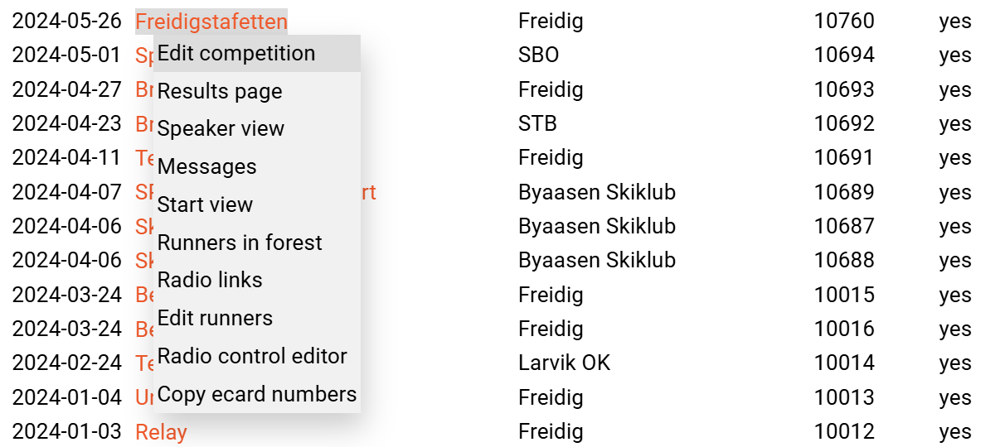

Linkene er som følger:

- **Edit competition**: Sette parametere for aktuelt løp
- **Results page**: Den "vanlige" resultatvisningen
- **Speaker view**: Resultatvisning med speaker-funksjoner (se avsnitt under)
- **Messages**: Meldingsloggen
- **Start view**: Side som viser løpere til opprop og hvor man enkelt kan sette løpere som "ikke startet"
- **Runners in forest**: Side som viser gjenværende løpere
- **Radio links**: Side som viser linker til utvalgte sider: mål-scroll, meldepost-scroll og løpere igjen i skogen (se avsnitt under)
- **Edit runners**: Side der alle løpere er listet, og hvor man kan redigere utvalgte løper-data
- **Radio control editor**: Side for å redigere på meldepost oppsett
- **Copy ecard numbers**: Side for å liste opp løpere med ulikt brikkenummer i to løp, med mulighet for å overføre brikkenummer fra ett løp til et annet. For løpere man velger dette for, genereres det meldinger som klienten leser og behandler.

## Opprette løpet

- Gå inn på admin-sidene: [https://liveres.live/adm/](https://liveres.live/adm/). Denne siden krever brukernavn og passord som du får tilsendt.
- For eTiming og Brikkesys: Velg "Create new competition". For å sikre at klienten kobler til riktig løp på serveren, sjekkes dato og arrangør mot det som står i eTiming eller Brikkesys. Sørg derfor for at disse to elementene er helt like både på liveres.live og i basene.
- For Time4o: Velg "Connect Time4o events"
- Notér CompetitionID som blir tildelt løpet.

De andre valgene på en admin side for et løp er:

### Main competition data

- **Competition ID**: Løpsnummeret du trenger i klienten for å laste opp til riktig online arrangement.
- **Time4oID**: Dersom man har kobling mot et Time4o-arrangement, legges ID inn her (den legges inn automatisk når man kobler løp sammen som forklart over). For eTiming og Brikkesys skal denne stå tom.
- **Date**: Arrangementets dato i formatet yyyy-mm-dd

- **Time zone diff**: Brukes for å få løpende tid til å gå riktig i forhold til tidssonen hvor løpet arrangeres. Bruk 0 for løp i Norge. Sommertid tas det automatisk hensyn til.
- **Sport**: Velg hvilken type idrett arrangementet har. Dette vises i oversikten.
- **URL**: Link til f.eks. Eventor eller hjemmeside for arrangementet. Bruk komplett referanse slik som [https://www.abc.com](https://www.abc.com). Vises til høyre i arrangementslisten.
- **Livelox ID**: Oppgi ID-nummer til Livelox og få linker direkte fra resultatlista per klasse til tilsvarende på Livelox. ID (her: 170578) finnes fra URL som eksempelet under: `https://www.livelox.com/Events/Show/170578/Mitt:lop`

### Appearance

- **Public**: Kryss av her for å vise løpet i oversikten på startsiden til LiveRes.
- **Show ecard split times**: Slå på visning av strekktider (må lastes via klienten)
- **Show course results**: Slå på visning av resultater per løype.
- **Show tenths of seconds**: Bruk denne for å vise tider med tideler.
- **Show times in sprint heats**: Viser tider i kvartfinale, semifinale og finaleheat for sprint.
- **Use dynamic ranking from start**: Kryss av for å slå på predikert sortering også på første meldepost (eller i mål dersom det ikke er meldeposter i løypa). Det vil i praksis si at de som nylig har startet blir rangert øverst i lista og flyttes nedover når tiden på første meldepost har gått ut. Dette fungerer best når de antatt sterkeste løperne starter til slutt, og det ikke er for lang tid til første meldepost.
- **Highlight duration**: Hvor lenge en tid skal markeres i rødt etter at den er nyregistrert.
- **Qual. classes og Qual. limits**: Se forklaring under.
- **Show scrolling info text**: Slå på visning av infotekst som ruller øverst på siden.
- **Info text**: Tekst som skal rulle over øverst på skjermen.

### Online Entry

- **Remove ecard in online entry**: Ikke krev brikke(nummer) ved selvpåmelding.
- **Allow new club in online entry**: Tillat at brukeren oppretter ny klubb ved online påmelding.

### Multi-day competition

- **Multi-day stage no**: Dersom løpet inngår som del av en flerdagskonkurranse, legges løpsnummeret inn her. Sett 0 eller la feltet stå tomt ellers.
- **Multi-day parent ID**. Legg inn CompetitionID på første løpet i flerdagerskonkurransen her. Alle løp i løpsserien refererer til samme "parent".

### Links and QR codes

Her finner man linker og QR-koder til resultatsiden, online påmelding og online brikkeendring.

### Radio Controls

Under denne overskriften følger det flere lenker for sletting, tillegg og redigering av meldepostoppsettet. Merk at dersom man redigerer meldeposter må man samtidig ta bort krysset for "Update radio controls" i klienten for å bevare endringene etter oppstart av klienten (se "Starte opplasting på nett" for dette valget).

- Man kommer til en tabelloversikt med mulighet for manuell redigering av titler m.m. ved å følge lenken **Radio control editor**.
- **Delete all radio controls**: Sletter alle meldeposter for aktuelt arrangement.
- **Add radio control for all classes**: Legger til en meldepost for alle klasser. Velg "order" slik at den kommer inn før "Tid" for urangerte klasser. F.eks. 500 er en god verdi.
- **Add single radio control**: Legger inn en ny meldepost i angitt klasse.

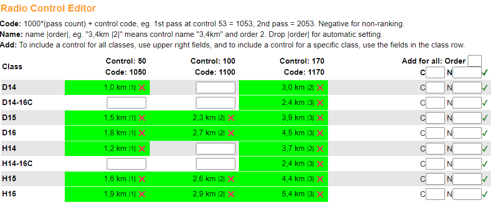

*Mellomtidseditoren*

### Bruk av premie-/kvalifiseringsgrenser

Merk at for Time4o-løp kan disse grensene settes i Time4o.

Bruk av kvalifiseringsgrenser (kan også brukes for premiegrenser) gir en linje i resultatlista på angitt plassering. Dersom denne funksjonen skal brukes, legges det inn hvilke klasser dette gjelder for, adskilt med komma. Klassene oppgis med anførselstegn rundt klassenavnet:

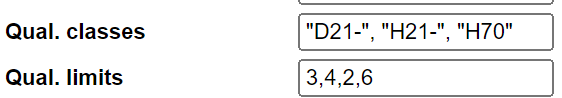

Dersom det ikke er angitt noen klasser, brukes samme grense for alle klasser i løpet. Dersom det oppgis én klasse mindre enn antall grenser, brukes den siste grensen for resterende klasser.

Grense angitt som heltall tilsvarer grensen i plassering. -1 betyr at det ikke skal vises grense for klassen. Et tall mellom 0 og 1 angir grensen som en fraksjon av antall startende (ikke startet trekkes fra). F.eks. for å indikere ⅓ premiering angir man 0.333 for de aktuelle klassene. Antallet rundes av oppover.

# Opplasting av resultater til nett

Start LiveRes-klienten ved å starte EXE-filen som ble pakket ut fra ZIP-filen (se installasjon). Når man starter LiveRes-klienten, ledes man gjennom noen steg for å koble klienten mot Time4o (velg IOF XML) eller den lokale eTiming- eller Brikkesys-basen. For eTiming støttes både Access og Microsoft SQL Server (f.eks. MS SQL Express).

Du kan koble klienten til eTiming- eller Brikkesys-basen over det lokale nettet, eller kjøre klienten på samme PC som basen ligger. Fordelen med at klient og baser er på samme PC er at man ikke belaster det lokale nettverket ved spørringene som gjøres. PC med klienten må ha internett-tilkobling.

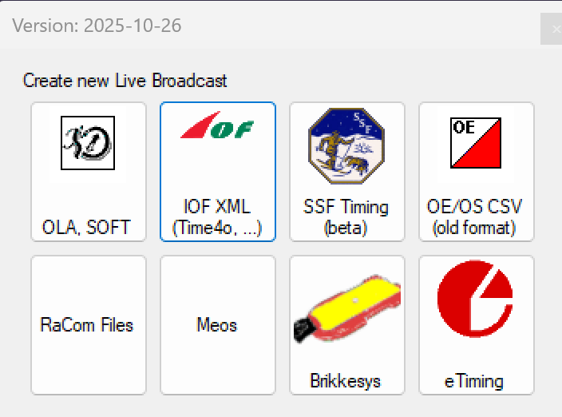

## Tilkobling til Time4o (for strekktider)

For å laste opp strekktider for Time4o bruker man fileksport via en URL. I Time4o setter man opp en link som LiveRes-klienten bruker for å hente resultater og strekktider.

Oppsett i Time4o:

1. Under resultater trykker man på knappen med tre prikker og velger "Strekktider LiveRes" for å komme til innstillinger for denne oppgaven.

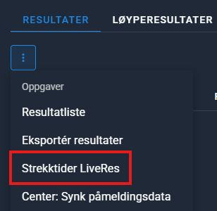

2. Nede på siden trykker man på "DELINGER" og deretter på pluss-knappen for å opprette en ny deling:

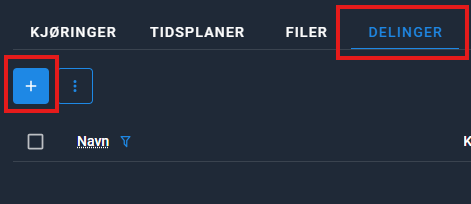

3. Ved oppsett av delinger krysser man av for "Kjør oppgave" og trykker deretter på LAGRE.

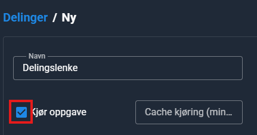

4. Kopier delingslenken som blir opprettet (den er på formatet `https://app.time4o.com/share/xxx...`.):

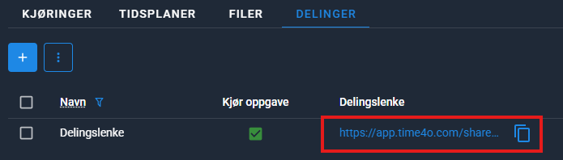

5. Start LiveRes klienten og velg IOF XML
6. Lim inn delingslenken i feltet "Export URL". Fyll også inn løps-ID ("CompetitionID") og klubb ("Organizer") som må stemme med det som ble lagt inn da løpet ble opprettet på admin-siden av LiveRes. Sett refresh tid (oppdateringsfrekvens). Anbefalt oppdateringstid for strekktider er hver 60 til 120 sekunder.

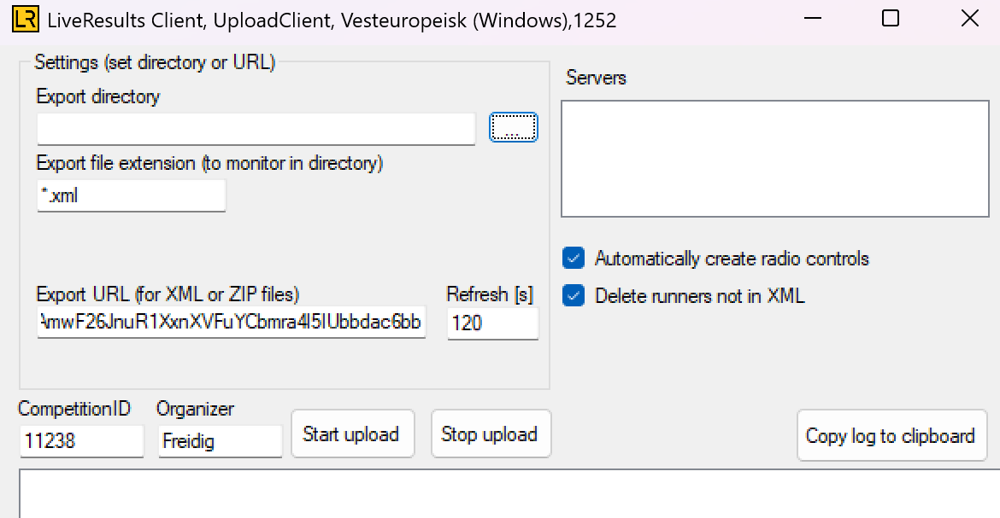

7. Trykk på "Start upload", og data sendes til LiveRes sin webserver.
8. For å spare mobildata kan gjerne PC-klienten kjøre på en PC som står med fast nett-tilkobling (og ikke trenger å være fysisk der løpet pågår). Pass da på at aktuell PC ikke går i dvale.

## Tilkobling til eTiming

Du kommer etter hvert til siden vist under. Forklaring følger.

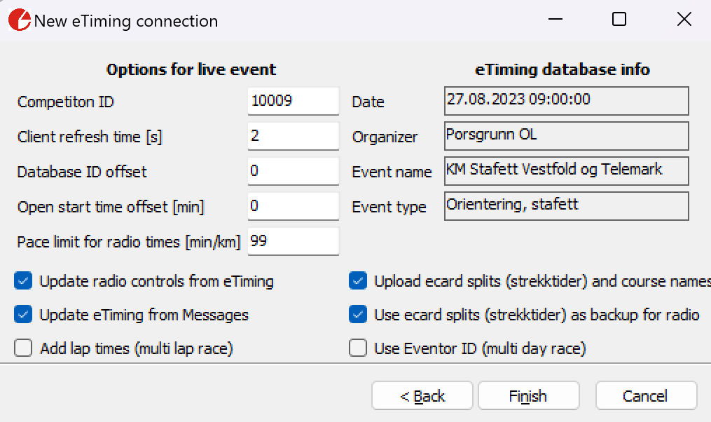

- **Competition ID**: Her fyller du inn løpsnummeret du fikk ved opprettelsen av arrangementet.
- **Client refresh time [s]**: Hvor lenge klienten skal gå i "dvale" mellom hver gang den sjekker etter nye resultater. Hele basen blir sjekket hver gang. Erfaringsmessig tar ett søk under ett tidels sekund. For Access-baser tar det 2-4 sekunder fra et resultat er endret til det er "synlig" for klienten. For SQL Server skjer det tilnærmet umiddelbart.
- **Database ID offset:** Denne offset legges til løper-ID som hentes fra eTiming. Dette muliggjør opplasting fra flere eTiming (og Brikkesys) baser mot den samme LiveRes-basen uten fare for å overskrive løpere. Aktuelt f.eks. dersom man har elite og andre klasser i hver sin lokale base og ønsker én felles LiveRes side for alle resultatene. Normalt står denne til 0. **Merk** at dersom ID offset står til 0 vil løpere bli slettet fra LiveRes basen om de ikke har matchende ID i den lokale basen. Bruk derfor ID offset større enn 0 på **alle** klienter som inngår i felles opplastning.
- **Open start time offset [min]**: For klasser med fri starttid og online 0-bukk på start vil denne parameteren sette faktisk starttid det angitte antallet minutter fram i tid (avrundet nedover). Setter man for eksempel 3 minutter her, vil løpere som leser brikken på ePost 0 på start få satt starttid mellom 2 og 3 minutter fram i tid, avrundet nedover til hele minutt. Ved 0 som verdi settes avlesningstidspunktet som starttid.
- **Pace limit for radio times [min/km]**: Angi her en minimal kilometertid for løpet. Passeringer som er raskere enn dette blir ikke lastet opp. Krever angivelse av avstand til meldepost (se eget kapittel om dette). Bruk 0 om funksjonen ikke skal brukes.
- **Update radio controls from eTiming**: Kryss av dersom man ønsker å oppdatere mellomtidsoppsettet fra eTiming. Dersom denne er krysset av, oppretter eller oppdaterer klienten mellomtider basert på oppsett i eTiming. Merk at rekkefølgen på meldepostene i livesystemet blir det samme som satt i eTiming. Ta bort krysset om man f.eks. har satt opp mellomtider i mellomtidseditoren og ikke ønsker at dette skal overskrives.
- **Update eTiming from Messages**: Ved avkryssing på denne, vil LiveRes klienten oppdatere eTiming basen når det kommer meldinger fra start om "ikke startet", brikkenummer-endringer og direktepåmeldinger.
- **Add lap times (multi lap race).** Ved kryss her beregnes tiden mellom hver meldepost og skrives til server for å vises på linje 2 i online resultatene. Typisk bruk er dersom man løper runder og man vil oppgi **rundetider** i tillegg til passeringstiden. Se eksempler under.
- **Upload ecard splits (strekktider) and course names:** Legger inn strekktider fra Emit-brikken (etter avlesning i mål) og laster opp navnet på løypene.
- **Use ecard (strekktider) as backup for radio times**: Etter avlesning av brikken sjekker LiveRes klienten om det finnes brikketider for meldeposter som det ikke er registrert tider fra. Disse brukes da som backup. Krever at brikketid på siste post er mellom 0 og 5 minutter kortere enn sluttid for å unngå å sette inn feilaktige brikketider.
- **Use Eventor IDs (multi day race)**: Bruker løper ID som følger med fra Eventor-import i stedet for eTiming ID. Feltet heter "kid" i eTiming. Dette er nyttig for flerdagers løp der man har uavhengige eTiming baser og ønsker å samle resultater via Eventor ID. Løpere uten Eventor ID i basen får generert alternativ ID som ikke overlapper med Eventor ID.
- **eTiming database info**: Her kommer det opp info om den lokale basen man har koblet til slik at man kan være sikrere på at det er rett base for online resultat. Før oppkobling verifiseres dato og arrangør (organizer) herfra med det som er angitt på LiveRes-serveren. Ved avvik stoppes opplasting.

## Tilkobling til Brikkesys

Brikkesys-klienten har færre valg enn eTiming klienten. Klienten kjøres hvert 3. sekund og oppdateres fra meldinger. Strekktider lastes alltid opp til server.

Etter å ha valgt Brikkesys, skriver man inn login info til Brikkesys-databasen:

- **Host:** Maskin med basen, gjerne localhost
- **Port:** Ofte 3306
- **Username**: brukernavn for Brikkesys' resultatdatabase (Tips: ofte "root" - se config-fila til Brikkesys)
- **Password**: Passordet for Brikkesys' resultatdatabase (Tips: se config-fila til Brikkesys)

I neste trinn velger man hvilket løp som skal kobles opp.

Deretter får man opp en side hvor man skriver inn:

- **CompetitionID**: Her fyller du inn løpsnummeret du fikk ved opprettelse av arrangementet på liveres.live/adm
- **Organizer**: Dette feltet må samsvare med det som ble oppgitt ved opprettelsen av løpet.
- **Database ID offset:** Samme funksjon som tilsvarende felt for eTiming klienten. Denne offset legges til løper-ID som hentes fra Brikkesys-basen. Dette muliggjør opplasting fra flere lokale baser mot den samme LiveRes-basen uten fare for å overskrive løpere. Aktuelt f.eks. dersom man har elite og andre klasser i hver sin base og ønsker én felles LiveRes base for resultatvisning. Normalt står denne til 0. **Merk** at dersom ID offset står til 0 vil løpere på online basen som ikke har matchende ID i den lokale basen bli slettet. Bruk derfor ID offset større enn 0 på **alle** klienter som inngår i felles opplastning.

For Brikkesys, må meldeposter legges inn manuelt via "Radio control editor". Formatet som brukes står øverst på siden i editoren. Meldeposter i klasser uten visning av tid eller urangerte får mellomtider inn på negative postkoder. F.eks. om en meldepost har kode 31, får vanlige klasser dette inn på kode 1031, mens de nevnte klassene får det på kode -1031.

# Oppsett av tidtakings-database

Dette kapittelet gjelder bare for eTiming og Brikkesys.

## Klasser og visningstyper

Ved oppstart (se kapittel [opplasting på nett](#opplasting-av-resultater-til-nett)) vil PC-klienten lese klasser, tidtakingstype og mellomtidsoppsettet fra valgt kilde, slik at det er i tidtakingsprogrammet man modifiserer disse opplysningene. Dette gjelder også for stafetter.

LiveRes støtter ulike tidtakingstyper som settes i klasseoppsettet:

- **Normal**: Viser tider og rangerer resultatene
- **Ikke rangert**: Viser tider i tilfeldig rekkefølge uten plassering (eks. D/H 9-10, N2/B/C-åpen 10-16)
- **Ikke vis tid**: Viser "Fullført" i stedet for anvendt tid. (eks. N-åpen)
- **Ikke ranger/ikke på nett**: Løpere/klasse vises ikke på nett (eks. arrangør, skygge, prøveløpere)

## Løypelengder og løypenavn

Løypelengder og løypenavn hentes fra løypetabellen i eTiming og Brikkesys dersom dette er angitt:

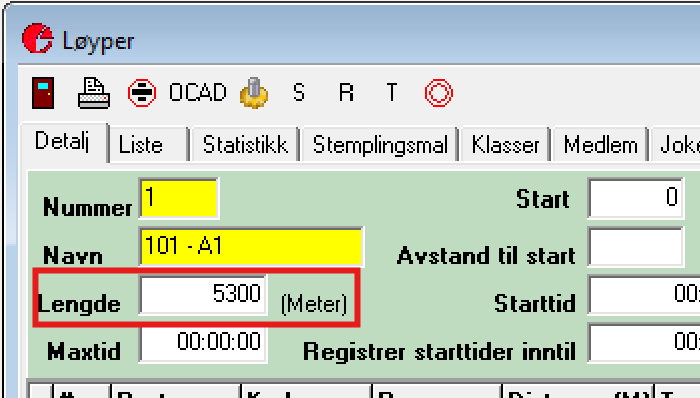

Løypelengden (angitt i kilometer) publiseres sammen med klassenavnet og brukes også for å beregne kilometertider (m/km):

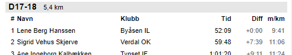

Dersom flere løyper er i bruk i samme klasse (f.eks. i stafetter), vises korteste og lengste løypelengde:

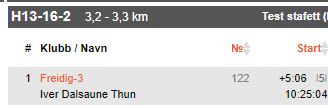

I stafetter vil en løper få beregnet kilometertid basert på lengden på den gaflingsvarianten løperen har løpt.

## Mellomtidsoppsett

I løp som bruker Time4o, leses mellomtidsoppsettet direkte fra Time4o.

For Brikkesys, må meldeposter legges inn manuelt via [Radio control editor](#radio-controls)". Formatet som brukes i dette oppsettet står øverst på siden i editoren.

Det som følger under gjelder for eTiming:

LiveRes-klienten leser mellomtidsoppsettet som angis i eTiming via menyen Resultat -> Registrer GPRS stasjoner. Stafetter er et spesialtilfelle som omtales i neste kapittel.

Man setter opp meldeposter per løype. Alle klasser som benytter aktuell løype får det angitte oppsettet. Følgende er det viktig å passe på:

- Rekkefølgen på meldepostene er gitt i kolonnen *Nr*
- Overskriften i LiveRes tabellen er angitt i kolonnen *Beskrivelse*. Gjør dette så kort som mulig for bedre visning på små skjermer som mobiltelefoner. Bruk f.eks. *FV* og *Pass* for forvarsling og passering. Og gjerne beskrivelser som *3,4km* for andre meldeposter.
- Distanse (i meter) kan angis. Dersom det samtidig er angitt en verdi i klientens felt *Pace limit for radio times [min/km]*, kan klienten se bort fra feilaktige mellomtider. Dersom feltet ikke er fylt inn, vil alle mellomtider for denne koden bli brukt. Se eksempel under.
- Feltet *kode* i eTiming består av kode\*100 + "passeringsteller". For eksempel blir passering av kode 121 for andre gang til koden: 121\*100 + 2 = 12102. Denne koden oversettes automatisk til LiveRes sin interne kode, som er noe annerledes.
- Feltet *Live* angir om mellomtiden brukes i LiveRes.

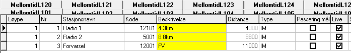

Fra versjon 2023-08-13 kan man bruke tekstkodene "{dist}" og "{no}" for å hente ut data fra løypene i eTiming og beregne lengden og/eller postnummeret på aktuell meldepost. "{dist}" blir erstattet med teksten "xx,xkm", og "{no}" erstattes med postnummeret på formatet "#x". Tekstkodene kan brukes hver for seg eller sammen, og kan kombineres med fri tekst foran, mellom og/eller etter. Dersom man bruker "{dist}" og det ikke er fylt inn noe i Distanse-feltet for aktuell meldepost, settes beregnet distanse inn for bruk til verifisering av mellomtider (se forklaring over).

Eksempel på oppsett:

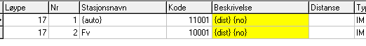

Som gir dette resultatet:

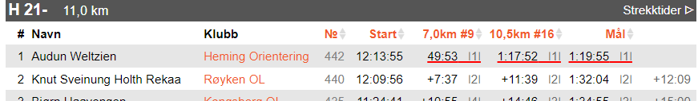

## Stafett

Stafetter støttes i LiveRes for alle typer system: Time4o, eTiming og Brikkesys. Oppsettet i Time4o gjøres direkte der. Oppsett i Brikkesys gjøres via *Radio control editor*. Det følgende gjelder oppsett i eTiming:

Stafetter behandles noe spesielt da etappetid vises ved meldeposter og i mål for etappe 2 og senere. Stafetter identifiseres automatisk ved at løpstype "orientering, stafett" eller "langrenn, stafett" er valgt i eTiming (løpstype 3 eller 6).

For stafetter brukes løypekoden/nummeret som klassen er satt opp med og ikke de enkelte løperne (som gjerne har forskjellig pga gafling). Klienten takler individuelle klasser sammen med stafettklasser i samme base/arrangement.

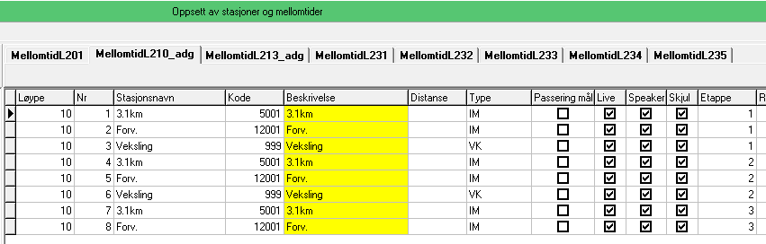

*Eksempel på oppsett for stafett i eTiming.*

LiveRes støtter omstart i stafett. Når man registrerer at lag har gått ut på fellesstart i eTiming, vil disse lagene rangeres bak lag som har unngått omstart, selv om totaltiden er kortere. I web-visningen markeres sammenlagttider der det har vært omstart med en stjerne. Se eksempelet under.

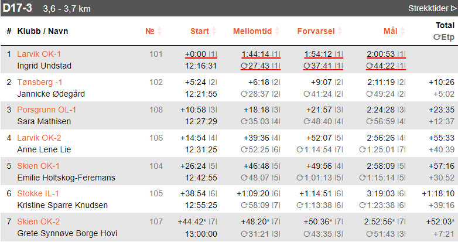

*Indikasjon på omstart er vist for laget på 7. plass med en stjerne bak lagets tid.*

## Jaktstart

Oppsettet i Time4o gjøres direkte i Time4o. Det følgende gjelder eTiming og Brikkesys. Oppsett i Brikkesys gjøres i *Radio control editor*.

For klasser der det er krysset av for jaktstart, vil klienten laste opp passeringstider og totaltid/sammenlagttid for hver meldepost og i mål (samme oppsett som for stafetter).

Sammenlagttiden er etappetid + grunnlagstid. I Brikkesys er grunnlagstid forskjellen mellom løperens starttid og klassens starttid. I eTiming er det to muligheter: Dersom det finnes en tid i feltet "Totaltid" brukes denne som grunnlagstid. Dette feltet oppdateres automatisk av eTiming ved bruk av flerdagers arrangement. Dersom feltet ikke er fylt inn, vil LiveRes klienten sette grunnlagstid lik forskjellen mellom løperens starttid og klassens starttid.

I eTiming sjekkes det også på hvor mange godkjente løp en løper har før jaktstarten. Dersom det mangler godkjente løp, settes status på løperen til "utenfor konk." og disse løperne rangeres nederst på resultatene. Det sjekkes på antall løp mot hvilket dagnummer løpet er. F.eks. dersom det er jaktstart dag 3, vil bare løpere som har 2 godkjente løp før jaktstarten få godkjent jaktstart. Merk da at dersom det arrangeres jaktstart på dag 1 (man oppretter jaktstart manuelt), må løpere som ikke skal telle i jaktstarten settes til -1 antall løp. Det er feltet "Ant løp" som brukes til dette.

Dersom man skal lage meldepostoppsettet manuelt for jaktstart (aktuelt for Brikkesys), må man passe på å opprette "meldepost" for starttid, etappetid og både passeringstider og etappetider for hver meldepost. Se dette [eksempelet](https://liveres.live/adm/radiocontrols.php?comp=10681).

## Sprint

LiveRes klienten behandler løpstype *sprint* i eTiming noe spesielt. Typisk anvendelse er langrennssprint der det gjennomføres prolog og finaleheat (kvartfinaler-semifinaler-finaler).

I dette tilfellet leser klienten om resultatene skal behandles som prolog eller et av finaleheatene. Det opprettes egne klasser for hvert tilfelle som vises i web-visningen.

# Online påmelding og brikkebytte

Via egne sider er det mulig å sette opp online påmelding/etteranmelding og selvbetjent brikkebytte. Time4o har egne funksjoner for dette.

## Påmelding

LiveRes tilbyr en egen side for online påmelding med støtte for eTiming-baser (ikke støtte for Brikkesys foreløpig).

Det er kun mulig å melde seg på i klasser der det er definert løpere med status *ledig* i eTiming (ønsker man ledige plasser som ikke skal være tilgjengelig for påmelding, kan man bruke status avmeldt for disse).

Man velger om brukeren selv skal kunne opprette en ny klubb. En grunn for at man ikke ønsker at klubber opprettes, er å sikre at man har faktura-informasjon til klubber som direktepåmeldte benytter.

Klienten må være aktiv for å åpne web-påmeldingen. I klienten må det være krysset av for å tillate oppdatering via meldinger (*Update eTiming from Messages*). Oversikt og logg med påmeldinger finnes i meldingstjenesten knyttet til løpet.

Teknisk fungerer funksjonen ved at klienten leser eTiming-basen og legger opp løpere med status *ledig* ut på webserveren. Påmeldingssiden etterspør hvilke klasser det finnes ledige plasser i, og tilbyr disse i en nedtrekksmeny. Det samme gjelder hvilke klubber som er tilgjengelige. Videre sjekkes det for unikt brikkenummer før det genereres en melding til LiveRes meldingssenter med data om den nye påmeldte løperen. Denne meldingen plukkes opp av klienten som gjør automatisk tildeling av ID og evt startnummer i eTiming basen.

Det er link og QR-kode tilgjengelig fra admin-siden for aktuelt løp.

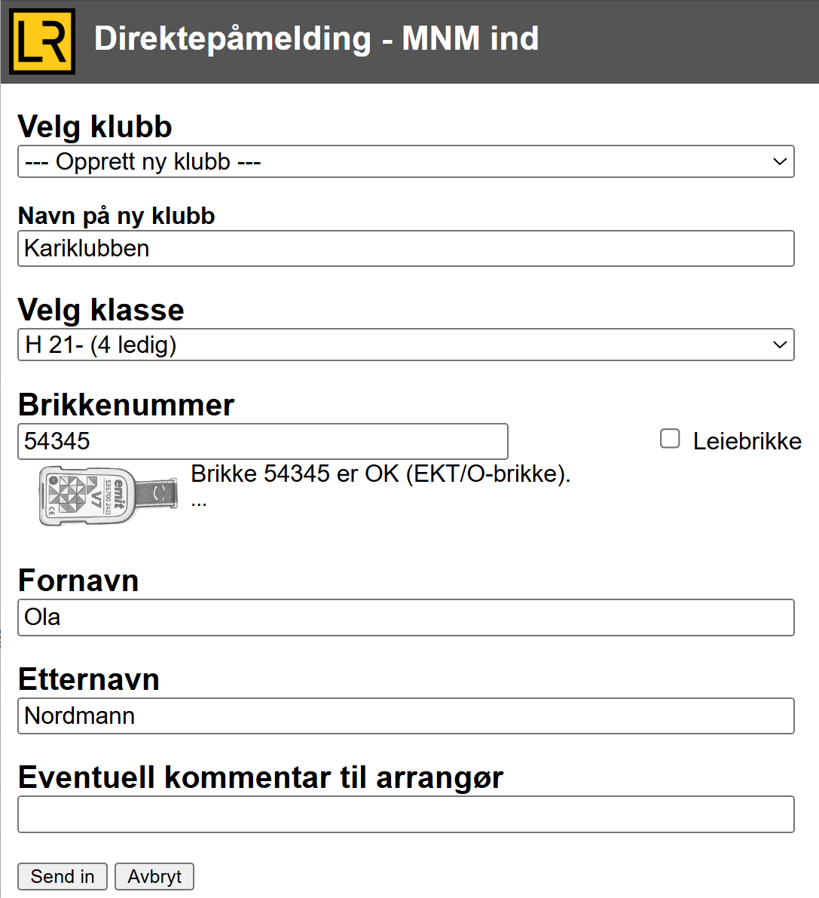

## Brikkebytte

LiveRes har også en egen side for online brikkebytte med støtte for både eTiming og Brikkesys baser. Time4o har egen funksjon for dette.

Klienten må være aktiv for at brukeren skal få tilbakemelding om vellykket oppdatering. Brukeren kan likevel legge inn endringer med inaktiv klient. Da vil endringene først bli gjennomført ved oppstart av klienten. I klienten må det være krysset av for å tillate oppdatering via meldinger ("Update eTiming from Messages"). Oversikt og logg med endringene finnes i meldingstjenesten knyttet til løpet.

Endringen gjennomføres ved at man søker opp aktuell løper fra deltakerlista og legger inn brikkenummeret det skal byttes til. Dersom brikkenummeret allerede er i bruk, kan man ikke endre til dette nummeret. Endringen gjøres automatisk mot samme type brikke. Har en løper en emiTag og en EKT-brikke, og man legger inn et nytt emiTag-nummer, er det emiTag som blir endret.

Det er link og QR-kode tilgjengelig fra admin-siden for aktuelt løp.

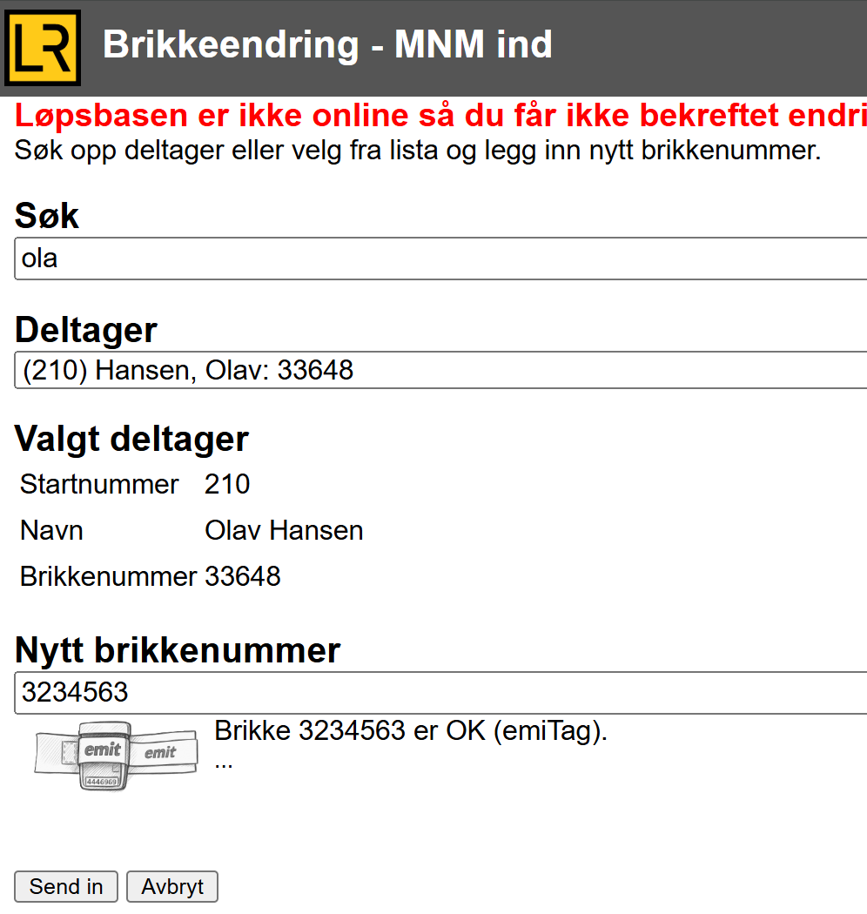

# Brikkesjekk

Brikkesjekk for eTiming og Brikkesys kan gjøres ved å bruke Torgeir Aunes brikkesjekkprogram ([https://github.com/Taune/EmiTagCheck](https://github.com/Taune/EmiTagCheck)). Dette programmet leser startlista og kan foreta endringer av brikkenummer via LiveRes-databasen. Løpere som har sjekket brikken får grønn hake i startregistreringssiden og på siden over løpere igjen i skogen. Det finnes tilsvarende funksjonalitet i Time4o sin brikkesjekk.

# Diverse spesielle visninger

## Speaker-visning

Det er laget en egen side for speaker (tilgjengelig som lenke fra admin-siden). [Eksempel](https://liveres.live/followfull.php?comp=10035&speaker)

Denne siden er lik den ordinære LiveRes-websiden, bortsett fra at den har et søkefelt der man kan skrive inn startnummer. Søket gjøres blant alle løpere i aktuelt løp, og et treff gjør at klassen vises med den valgte løperen markert som vist under.

Siden har også ett døgns begrensning før den trenger bruker-interaksjon, mot 30 min for den vanlige web-siden.

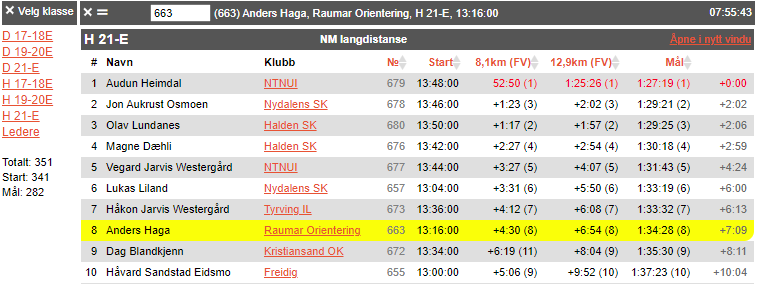

## Radiopost-visning

Som en del av live-tjenesten er det laget en side/scroll for visning av passeringstider. Dette er en side for arrangøren og speaker. Sidene viser inntil de 40 siste løperne som har passert valgte post. [Her er et eksempel på en meldepost](https://liveres.live/radio.php?comp=10001&code=120).

Som URL-en viser, setter man inn koden for den aktuelle onlineposten. Her er kodeoversikten:

- 0 Start
- 1000 Mål
- -1 Alle meldeposter samlet (ikke mål)
- -2 Igjen i løypa
- [kode] Koden på meldeposten velger aktuell meldepost.

Lenker til disse sidene, samt meldingstjenesten, finnes enklest fra "radio"-lenken på admin-siden: [https://liveres.live/adm/](https://liveres.live/adm/)

Radio-visningen har et input-felt for filtrering. Dette velger rader som har treff på denne søkestrengen. Funksjonen kan brukes dersom man vil vise noen utvalgte meldeposter i samme scroll, f.eks. alle forvarsel. Filterer da med en tekst som alle aktuelle meldeposter har i beskrivelsen.

Dersom man skal få inn starttider (0-post), må man huske å angi serienummeret til eLinken eller ETS i mellomtidsoppsettet og kalle opp denne i et tidtakervindu (for å få inn tider fra kode 0).

Det er også mulig å begrense hvilke startnummer man ønsker å få oppdatering fra på radio-visningen ved å bruke parameterne `minbib` og `maxbib`, f.eks. kun vise nummer mellom startnummer 1 og 30:

[https://liveres.live/radio.php?comp=10017&code=1000&minbib=1&maxbib=30](https://liveres.live/radio.php?comp=10017&code=1000&minbib=1&maxbib=30)

Fargekodene på radio-siden er:

* GRØNN: Ny ledertid (farge vises i 15 sekunder)
* RØD: Ny tid (farge vises i 15 sekunder)
* GUL: Status annet enn godkjent (f.eks disket, brutt). Farge vises permanent.

## Startregistrering

LiveRes har en egen side tilpasset bruk av startere. URL-en har formatet: https://liveres.live/radio.php?comp=11176&code=0

På denne siden vises løperne i en periode før de skal i oppropssone (*Før*), i oppropssonen (*Båser*) og en tid etter de har startet (*Etter*). Det kan også filtreres på startnummer (*Min no*, *Max no*). Man velger tidsstart eller fristart (linker øverst til venstre).

I denne visningen vises løpere innenfor oppropstid med gul bakgrunn. Det er en tykk, svart strek som markerer overgangen til de som har startet. Man kan sende meldinger knyttet til løperne ved å trykke på meldingsknappen til høyre. Dette er spesielt aktuelt dersom løpere ikke starter. Se neste avsnitt.

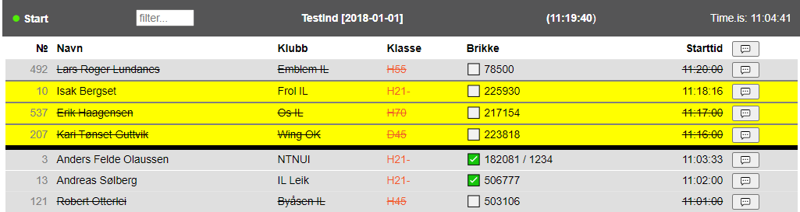

## Meldinger

LiveRes har en meldingstjeneste for kommunikasjon mellom start og tidtaker i målområdet. Ved å trykke på knappen ute til høyre på startsjekk-siden får man opp en dialog knyttet til aktuell løper (se bildet under). For registrerte løpere er standardteksten satt til *ikke startet*. 

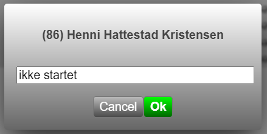

I løpskontoret kan man lese loggen fra start på en egen side, for eksempel denne:

[https://liveres.live/message.php?comp=10023](http://liveres.live/message.php?comp=10023).

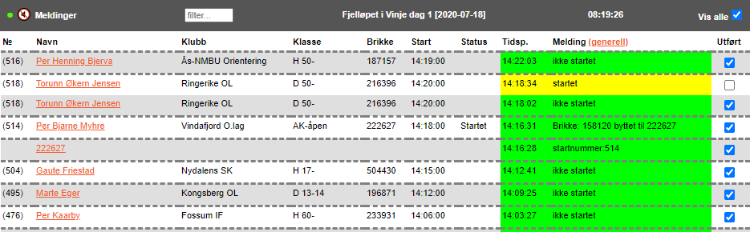

Dersom *Vis alle* er valgt, er alle meldinger i løpet synlige. Når man tar bort valget, vises bare aktive meldinger og tidligere meldinger knyttet til samme person eller brikke.

Fra meldingssiden kan man generere en ny melding knyttet til en person via lenken på personen. Det finnes også en lenke for å lage en generell melding i kolonnen *Melding*.

Øverst til venstre er det et høyttalersymbol. Når dette er aktivt får man et lydsignal når det kommer nye meldinger.

Om man har valgt *Update eTiming from messages* under oppstart av LiveRes-klienten, vil programmet prøve å endre eTiming-basen ved *ikke startet* og ved endring av brikkenummer. Triggere for dette ligger i bestemte felt i meldingsbasen som settes når disse meldingene opprettes. Dersom oppdateringen ikke var vellykket, lages det nye meldinger med informasjon om dette. Se for øvrig dokumentasjon av meldings-API under.

# Oppsett av lokal web-server

Her følger en oppskrift på oppsett av lokal web-server. Med dette oppsettet kan man håndtere og vise resultater på PC og nettbrett som er koblet til et lokalt nett sammen med eTiming-basen. Da fristiller man seg fra internettforbindelsen og kan ha resultatservice og tilgang for speaker uten å være avhengig av internett.

Gjør følgende:

- Last ned og installer [XAMPP](https://www.apachefriends.org/download.html) (versjon 8.2.0 er brukt her)
- Ta med minst tjenestene Apache og MySQL. Du trenger også phpmyadmin
- Start XAMPP og velg Admin knappen under MySQL
- Opprett databasen: Velg Databaser
- Opprett ny base med navn "liveres"
- Opprett tabeller: Velg SQL
- Lim inn innholdet som du finner i fila [doc\\createOnlineDatabase.sql.txt](https://github.com/palkitt/liveresults/blob/master/Doc/createOnlineDatabase.sql.txt)
- Kjør spørringen
- Kopier alle web-filer fra LiveRes prosjektet fra GitHub inn i html-katalogen til XAMPP. Default katalog for plassering av web-filer er `C:\\xampp\\htdocs`
- For eventuelt å endre oppdateringstiden på web-siden må du passe på å endre refresh tid i `api.php` og `radio.php` (linje 15)
- `$refreshTime = 2;` (f.eks)
- Åpne admin-siden [https://localhost/adm/admincompetitions.php](http://localhost/adm/admincompetitions.php)
- Opprett minst ett løp. Vi skal senere endre navn, datoer og løpsnummer, så det er ikke så nøye hva disse settes til nå.
- Gå tilbake til MySQL Admin for XAMPP
- Gå inn i tabellen login
- Endre tavid til det samme nummeret som løpet du skal ha resultater for
- Endre compDate til aktuell dato
- Endre organizer til aktuell arrangør
- For å starte opplasting til den lokale SQL-basen trenger du nå å legge til adresse, bruker og passord i fila `LiveResults.Client.exe.config`
   - `<add key="emmaServer1" value="127.0.0.1;root;;liveres"/>`
- Om du også ønsker opplasting til ekstern base, legger du dette inn som emmaServer2:
   - `<add key="emmaServer2" value="xxx"/>`, 
   der xxx er innloggingsverdier du finner i den "originale" config-filen.
- Da er det klart for opplasting. Du kan gjenbruke den samme, lokale løpsbasen flere ganger ved å endre løpsnummer, dato og arrangør.

# API for meldinger

## Ikke startet

For å lage en melding som fører til at en løper blir satt til ikke startet, settes dns-flagget når meldingen sendes:

[https://api.liveres.live/messageapi.php?method=sendmessage&comp=10001&dbid=100&dns=1&message=ikke startet](https://api.liveres.live/messageapi.php?method=sendmessage&comp=10001&dbid=100&dns=1&message=ikke%20startet)

I dette eksempelet er løps-ID = 10001 og løper-ID = 100.

For å finne løpere og meldinger som skal behandles som ikke startet, kan metoden "getdns" brukes:

[https://api.liveres.live/messageapi.php?method=getdns&comp=10001](https://api.liveres.live/messageapi.php?method=getdns&comp=10001)

Når man skal kvittere ut at aktuell melding er behandlet, brukes metoden "setdns" med dns lik 0:

[https://api.liveres.live/messageapi.php?method=setdns&messid=191&dns=0](https://api.liveres.live/messageapi.php?method=setdns&messid=191&dns=0)

## Brikkebytte

For å lage en melding som genererer et brikkebytte, angir man database-ID med negativ verdi lik nytt brikkenummer, og startnummer som del av eller som hele meldingen. Samtidig settes parameteren ecardchange til 1:

[https://api.liveres.live/messageapi.php?method=sendmessage&comp=10001&dbid=-12345&ecardchange=1&message=startnummer:123](https://api.liveres.live/messageapi.php?method=sendmessage&comp=10001&dbid=-12345&ecardchange=1&message=startnummer:123)

I dette eksempelet ønskes brikkebytte for startnummer 123 til nytt brikkenummer 12345.

Metoden for å finne de som skal bytte brikker er

[https://api.liveres.live/messageapi.php?method=getecardchange&comp=10001](https://api.liveres.live/messageapi.php?method=getecardchange&comp=10001)

For å sette dette som utført:

[https://api.liveres.live/messageapi.php?method=setecardchange&messid=192&ecardchange=0](https://api.liveres.live/messageapi.php?method=setecardchange&messid=192&ecardchange=0)

## Brikke sjekket

URL for å sette at en brikke er sjekket er gjengitt under. Man kan bruke database-ID (dbid) eller startnummer (bib) for å identifisere løperen. Endringen settes i LiveRes-databasen og ikke i eTiming. Når en løper er markert med sjekket brikke, får løperen en grønn sjekkboks i radio-startsiden og status "brikkesjekk" i listen over løpere som er igjen i skogen.

API-kall for å sette at brikke er sjekket med database id:

[https://api.liveres.live/messageapi.php?method=setecardchecked&comp=10002&dbid=1](https://api.liveres.live/messageapi.php?method=setecardchecked&comp=10002&dbid=1)

API-kall for å sette at brikke er sjekket med startnummer:

[https://api.liveres.livemessageapi.php?method=setecardchecked&comp=10002&bib=11](https://api.liveres.live/messageapi.php?method=setecardchecked&comp=10002&bib=11)

## Betingelser for endringer

Betingelser for at en løper skal bli satt til "ikke startet":

- Meldingsteksten må være eksakt "ikke startet"
- Status må være "I" = "påmeldt"

Betingelser for å bytte brikkenummer:

- Må kun være ett treff på aktuelt startnummer
- Status på løper med aktuelt startnummer må være "I", dvs. "Påmeldt"
- Det nye brikkenummeret må ikke tilhøre noen andre løpere, eller tilhøre en ukjent løper: "U1 ukjent løper" (en løper som automatisk opprettes fra GPRS opplastinger i eTiming)

Hvilket brikkenummer oppdateres?

- Brikkenummer mellom 10 000 og 999 999 tolkes som o-brikker, andre som emiTag
- Dersom nytt brikkenummer er emiTag:
  - dersom det er satt en emiTag og en o-brikke, erstattes emiTag med nytt nummer
  - dersom det er satt en emiTag og en tom brikke, settes emiTag inn der det er tom brikke
  - begge eksisterende er emiTag eller o-brikker, settes nytt nummer inn som brikke nr 3

- Dersom nytt brikkenummer er o-brikke:
  - dersom det er satt en o-brikke og en emiTag, eller en o-brikke og en tom brikke, erstattes o-brikke med nytt nummer
  - begge eksisterende er emiTag eller o-brikker, settes nytt nummer inn som brikke nr 3

# Kontakt

Ved spørsmål eller forslag til forbedring, ta kontakt med ansvarlig for LiveRes:

Pål Kittilsen
+47 957 45 855
pal.kittilsen@gmail.com
